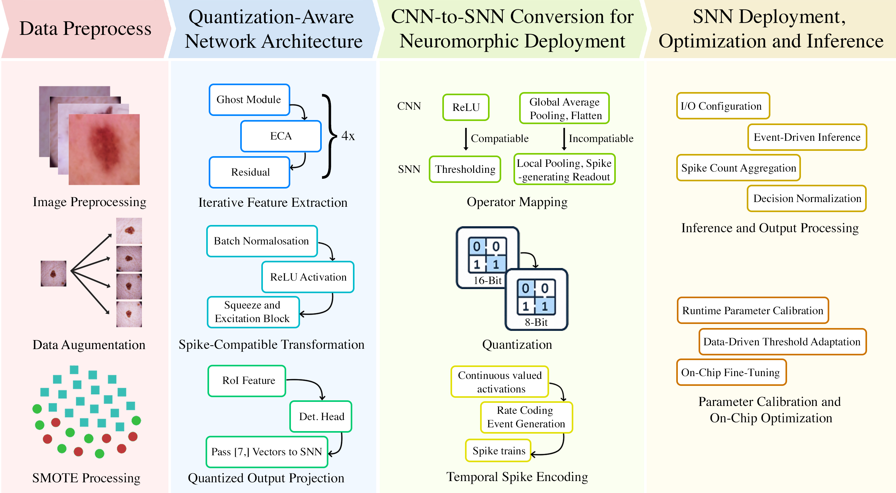
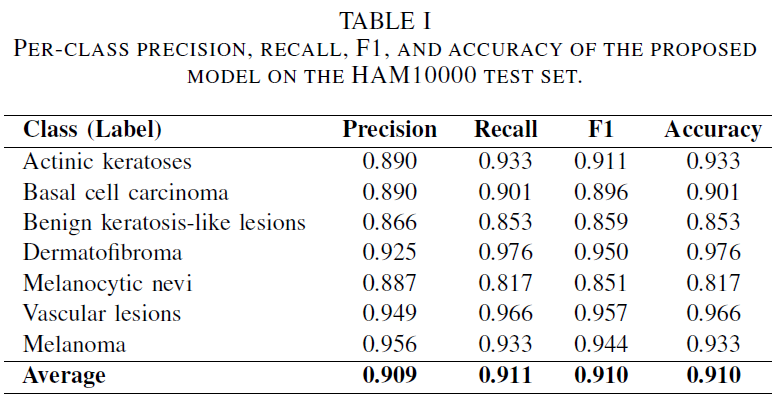
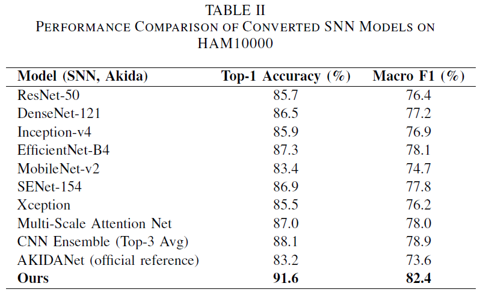
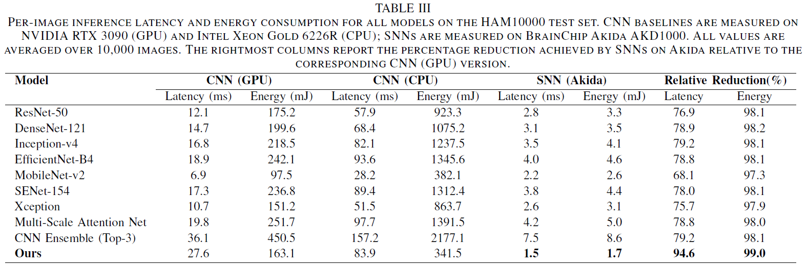
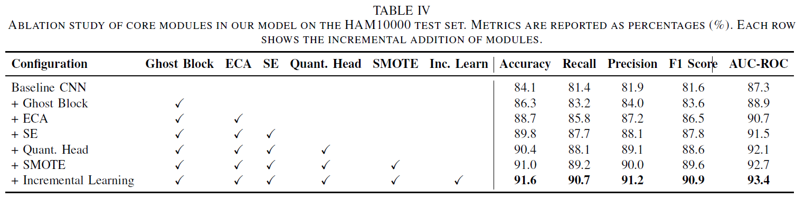
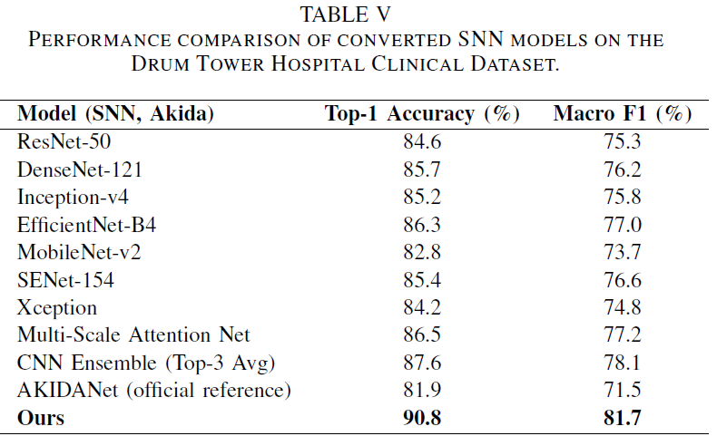

# Akida-Research-Project

We propose an end-to-end pipeline for energy-efficient and privacy-preserving Skin cancer classification using quantization-aware CNNs deployed as SNNs on BrainChip Akida hardware. The model is designed to support real-time inference and on-chip incremental learning in clinical edge environments.

---

## Table of Contents

1. [Introduction](#introduction)
2. [Methodology](#methodology)
3. [Model Setup](#model-setup)
4. [Experiments](#experiments)
    - [Dataset Description](#datasets)
    - [CNN&SNN model Results on HAM10000](#cnn&snn-model-results-on-ham10000)
    - [Comparison with SNN Baselines](#snn-comparison)
    - [Latency and Energy Efficiency](#latency-and-energy-efficiency)
    - [Ablation Study](#ablation-study)
    - [Generalization on Clinical Dataset](#generalization-on-clinical-dataset)
5. [Main Contributors](#main-contributors)

---

## Introduction

Skin cancer classification is a critical step in dermatological diagnosis. Traditional CNNs struggle with:

- Deployment on low-power edge hardware
- Small and imbalanced datasets
- Privacy concerns from cloud-based inference

To overcome these, we design a quantization-aware CNN using Ghost, ECA, and SE modules that seamlessly converts into an SNN optimized for BrainChip Akida neuromorphic chips.



---

## Methodology

The architecture comprises:

- **Ghost Blocks** for low-cost feature extraction  
- **ECA and SE** for efficient attention and recalibration  
- **Spike-compatible output head** to support CNN-to-SNN conversion  
- **SMOTE + Augmentation** for dataset balancing  
- **Akida MetaTF SDK** for conversion and on-chip learning

The model is trained on traditional GPUs and then ported to SNN via Akida tools.

---

## Model Setup

### Getting Started

1. Installing [conda](https://conda.io/projects/conda/en/latest/user-guide/install/index.html)
2. Creating conda environment
    - `conda env create -f environment.yml`
    - `conda config --add channels conda-forge`
3. Activating the environment
    - `conda activate akida`
4. Download the Skin Cancer MNIST: HAM10000 dataset from: https://www.kaggle.com/datasets/kmader/skin-cancer-mnist-ham10000?resource=download
5. Unzip it and move into root folder of repo

### Run working_CNN.py

1. Install Python dependencies:
   ```
   pip install -r requirements.txt
   ```

2. Run the application:
   ```
   python working_CNN.py
   ```
   
---

## Experiments

### Datasets

The HAM10000 dataset is a collection of dermascopic images of common pigmented skin lesions used for training of neural networks for automated diagnosis. It comprises of 10,015 dermatoscopic images sourced from various populations and captured through diverse modalities. It encompasses a comprehensive spectrum of diagnostic categories critical to the study of pigmented lesions. These categories include Actinic keratoses and intraepithelial carcinoma/Bowen's disease (akiec), basal cell carcinoma (bcc), benign keratosis-like lesions (comprising solar lentigines, seborrheic keratoses, and lichen-planus like keratoses, bkl), dermatofibroma (df), melanoma (mel), melanocytic nevi (nv), and vascular lesions (such as angiomas, angiokeratomas, pyogenic granulomas, and hemorrhage, vasc). This dataset is tailored to aid in the training and development of machine learning models in the field of dermatology.

---

### CNN&SNN model Results on HAM10000  



> **Explanation:** This table reports the per-class classification performance. The model shows high consistency across frequent and rare lesion categories, demonstrating robustness under data imbalance.

---

### Comparison with Other Converted SNNs  



> **Explanation:** Compared to other state-of-the-art CNNs converted to SNNs, our model achieves the highest accuracy and F1 under the same hardware and quantization constraints.

---

### Latency and Energy Efficiency  



> **Explanation:** Our Akida-deployed model achieves the fastest inference and lowest power consumption across all benchmarks, enabling real-time, battery-powered diagnostic systems.

---

### Ablation Study  



> **Explanation:** Each architectural component incrementally improves performance. The full model achieves maximum accuracy, proving the effectiveness of Ghost, ECA, SE, quantization, and incremental learning.

---

### Generalization on Clinical Dataset  



> **Explanation:** On real-world hospital data from Nanjing Drum Tower Hospital, our model outperforms other methods, confirming generalization to clinical cases beyond benchmarks.

---


## Main Contributors

This work was conducted by a research team from the University of Western Australia (UWA).

### Lead Contributors
- **Haitian Wang** – 
- **Xinyu Wang** - 
- **Yiren Wang** – Design and led the implementation of the CNN model pipeline. Conducted the model training and testing. Finalize the evaluation and result visualization.

---

> Contact: haitian.wang@uwa.edu.au  
> Project by: Department of Computer Science and Software Engineering, University of Western Australia, Australia.
